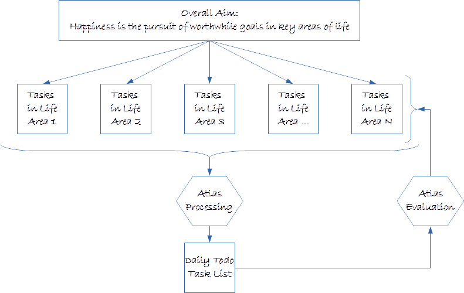

# What is Atlas?

> Happiness is the pursuit of worthwhile goals in key areas of life.
> This pursuit is done by continuously completing smaller and prioritized tasks.

Atlas (Automatic Task List Administration System) is a personal task management tool. It automatically compiles a daily todo task list based on task definitions in all relevant areas of life, and personal preferences.

# What can Atlas do for you?

Atlas helps you to:

* Break up goals into tasks
* Prioritize and sequence tasks
* Focus on what needs to be done _right now_
* Store new tasks and ideas for processing later on.

 
# How does it work?

Atlas workflow consists of the following steps:

1. Define all tasks that need to be done in each area of life
2. Select tasks with highest priority (top tasks) 
3. Specify personal schedulling preferences
4. Run Atlas to produce a daily todo task list.

As tasks are done during the day, they can be marked as done, or for further reschedulling. This information can be used for evaluating one's performance by Atlas.

  # Atlas workflow

# Who is it intended for?

Atlas is best suited for one's own personal use, rather than for large and complex projects.

# Development status

Atlas is in very early stages of development, and a lot of new features are in the works.

# Further reading

If you like what you have read so far, here are some more detailed articles that explain Atlas in more detail:

* What is an Atlas portfolio?
* How to install Atlas on Windows?

